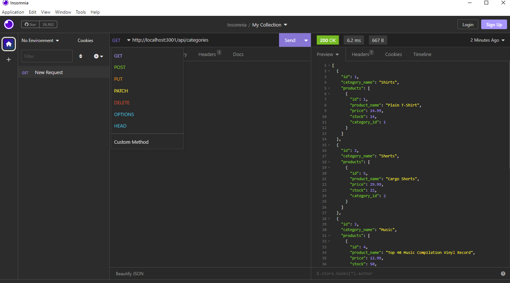

# E-Commerce Back End

## Task

Internet retail, also known as **e-commerce**, is the largest sector of the electronics industry, generating an estimated $29 trillion in 2019. E-commerce platforms like Shopify and WooCommerce provide a suite of services to businesses of all sizes. Due to their prevalence, understanding the fundamental architecture of these platforms will benefit you as a full-stack web developer.

The task for this project is to build the back end for an e-commerce site by modifying starter code and to configure a working Express.js API to use Sequelize to interact with a MySQL database.

## User Story

```md
AS A manager at an internet retail company
I WANT a back end for my e-commerce website that uses the latest technologies
SO THAT my company can compete with other e-commerce companies
```

## Acceptance Criteria

```md
GIVEN a functional Express.js API
WHEN I add my database name, MySQL username, and MySQL password to an environment variable file
THEN I am able to connect to a database using Sequelize
WHEN I enter schema and seed commands
THEN a development database is created and is seeded with test data
WHEN I enter the command to invoke the application
THEN my server is started and the Sequelize models are synced to the MySQL database
WHEN I open API GET routes in Insomnia for categories, products, or tags
THEN the data for each of these routes is displayed in a formatted JSON
WHEN I test API POST, PUT, and DELETE routes in Insomnia
THEN I am able to successfully create, update, and delete data in my database
```

## Video Demonstration

 * [Link to Video Demonstration](https://drive.google.com/file/d/1oTvCKmURUcKOzkbxIQ930YL828oy24wI/view)


## Database Models & Association

* `Category`

  * `id`

    * Integer.
  
    * Doesn't allow null values.
  
    * Set as primary key.
  
    * Uses auto increment.

  * `category_name`
  
    * String.
  
    * Doesn't allow null values.

* `Product`

  * `id`
  
    * Integer.
  
    * Doesn't allow null values.
  
    * Set as primary key.
  
    * Uses auto increment.

  * `product_name`
  
    * String.
  
    * Doesn't allow null values.

  * `price`
  
    * Decimal.
  
    * Doesn't allow null values.
  
    * Validates that the value is a decimal.

  * `stock`
  
    * Integer.
  
    * Doesn't allow null values.
  
    * Set a default value of `10`.
  
    * Validates that the value is numeric.

  * `category_id`
  
    * Integer.
  
    * References the `Category` model's `id`.

* `Tag`

  * `id`
  
    * Integer.
  
    * Doesn't allow null values.
  
    * Set as primary key.
  
    * Uses auto increment.

  * `tag_name`
  
    * String.

* `ProductTag`

  * `id`

    * Integer.

    * Doesn't allow null values.

    * Set as primary key.

    * Uses auto increment.

  * `product_id`

    * Integer.

    * References the `Product` model's `id`.

  * `tag_id`

    * Integer.

    * References the `Tag` model's `id`.


* `Product` belongs to `Category`, and `Category` has many `Product` models, as a category can have multiple products but a product can only belong to one category.

* `Product` belongs to many `Tag` models, and `Tag` belongs to many `Product` models. Allow products to have multiple tags and tags to have many products by using the `ProductTag` through model.

## How to Use

**NOTE** [Insomnia](https://insomnia.rest) was used to test API request for this code. Therefore, it is recommended to for user to use Insomnia in order to test this project. (Also MySQL server and npm must be installed to run this code.)

 * In main folder(Develop), install all of the npm package by using the following command:
     
     ```bash
    npm i
    ```
 * Next, source SQL file from MySQL to create database:
   
   ```
    source db/schema.sql
    ```
* Seed data to database model (you can use 'npm run seed' or run index.js file directly from seeds folder directly by doing 'node seeds/index.js'):

     ```bash
    npm run seed
    ```
* Then, invoke the application(server) with using the following command:

     ```bash
    node server.js
    ```

* Once the server starts listening, user can peform RESTful CRUD operation (make GET(retrieve data), POST(add data), PUT(update data), and DELETE(delete data) requests) on this three different API routes: /api/categories, /api/products, /api/tags
  * GET method also can be reqeusted with id. However, **PUT and DELETE** requests must be made with id to target specific data to update/delete (/api/categories/:id, /api/products/:id, /api/tags/:id) 

  

(**NOTE for testing in Insomnia** When POST or PUT data, use JSON format with correct fields inputs as they are shown in video demonstration.)

## Credits
 * npm package [MySQL2](https://www.npmjs.com/package/mysql2)
 * npm package [express.js](https://www.npmjs.com/package/express)
 * npm package [Sequelize](https://www.npmjs.com/package/sequelize)
 * npm package [dotenv](https://www.npmjs.com/package/dotenv)
 * [Insomnia](https://insomnia.rest)

---
© 2023 edX Boot Camps LLC. Confidential and Proprietary. All Rights Reserved.
